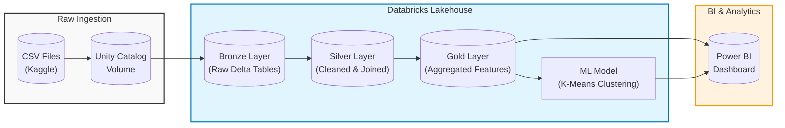
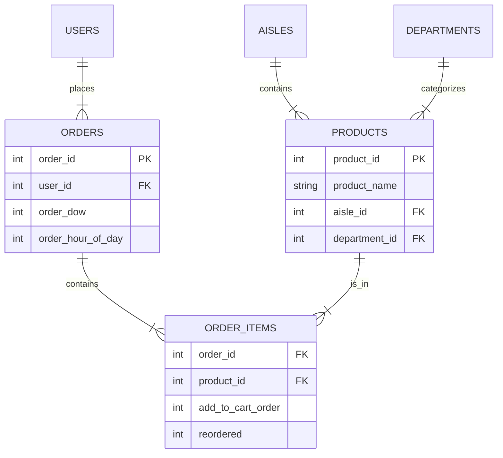

# 🛒 Instacart Market Basket Analysis: End-to-End Data Lakehouse

## 📖 Project Overview
This project demonstrates a production-grade **Data Engineering & Data Science** pipeline using the **Databricks Lakehouse Platform**. 

Using the real-world Instacart dataset (3M+ orders), I built a scalable **Medallion Architecture** (Bronze/Silver/Gold) to transform raw CSVs into business-ready insights. The pipeline culminates in a **K-Means Clustering model** that segments customers based on purchasing behavior, visualized in an interactive **Power BI Dashboard**.

### 🎯 Key Business Objectives
* **Customer Segmentation:** Group users into personas (e.g., "Loyal Super-Users" vs. "Churn Risks") to enable targeted marketing.
* **Market Basket Analysis:** Identify top-selling products and aisle trends to optimize inventory.
* **Operational Insights:** Analyze peak order times ("Rush Hour Heatmap") to improve delivery scheduling.

---

## 🏗️ Architecture
The project follows the **Medallion Architecture** best practices within a Delta Lake environment.

| Layer | Type | Description | Key Transformations |
| --- | --- | --- | --- |
| **Raw** | `Volume` | Landing zone for external CSVs | Direct upload to Unity Catalog Volume.|
| **Bronze** | `Delta Table` | Raw ingestion | Schema inference, metadata tagging (ingestion timestamp) .|
| **Silver** | `Delta Table` | Cleaned & Enriched | Handling nulls, removing "dirty" rows (e.g., malformed CSVs), joining lookup tables .|
| **Gold** | `Delta Table` | Business Aggregates | Feature engineering (e.g., `avg_basket_size`, `reorder_ratio`), KPI calculations .|

---

## 💾 Data Source & Model

The dataset used in this project is the **Instacart Online Grocery Basket Analysis Dataset**, available publicly on Kaggle. It contains anonymized data on over 3 million grocery orders.

* **Source:** [Kaggle - Instacart Market Basket Analysis](https://www.kaggle.com/datasets/yasserh/instacart-online-grocery-basket-analysis-dataset)

> **Note:** The data files are **not** included in this repository due to size constraints. Please download them directly from the source link above.

### Entity Relationship Diagram (ERD)

---

## 🛠️ Tech Stack

* **Cloud Platform:** Databricks Community Edition (Unity Catalog enabled)
* **Language:** Python (PySpark SQL & DataFrame API)
* **Storage Format:** Delta Lake (Parquet-backed ACID transactions)
* **Machine Learning:** Spark MLlib (K-Means Clustering)
* **Visualization:** Power BI (Connected via Databricks Partner Connect)

---

## 📊 Data Pipeline Phases

### Phase 1: Ingestion (Bronze)

* Configured Unity Catalog Volumes for secure file storage.
* Ingested 6 raw CSV files into Delta Tables.
* Preserved raw schema for auditability using `inferSchema=True`.

### Phase 2: Refinement (Silver)

* **Data Cleaning:** Imputed `null` values in `days_since_prior_order` (Logic: Null = 0 for new customers).
* **Error Handling:** Fixed malformed records in `products.csv` using `try_cast()` to prevent pipeline failures.
* **Data Modeling:** Denormalized `products`, `aisles`, and `departments` into a single `silver_products` dimension table.

### Phase 3: Aggregation (Gold)

Created "Analytical Base Tables" (ABT) for downstream users:

* `gold_customer_features`: User-level behavioral metrics.
* `gold_product_performance`: Sales volume and reorder rates per item.
* `gold_peak_times`: Aggregated order counts by Day of Week/Hour.

---

## 🤖 Machine Learning: Customer Segmentation

To understand user behavior beyond simple averages, I applied **Unsupervised Learning**.

* **Algorithm:** K-Means Clustering (Spark MLlib).
* **Features Used:**
* `total_orders` (Frequency) 
* `avg_days_between_orders` (Recency) 
* `avg_basket_size` (Monetary/Volume) 
* `reorder_ratio` (Loyalty) 

* **Results (k=3):**
1. **Loyal Super-Users:** High frequency (weekly), large baskets, 72% reorder rate.
2. **Core Regulars:** Bi-weekly shoppers, moderate spenders.
3. **Occasional Shoppers:** High churn risk, rare purchases, low reorder rate.

---

## 📈 Dashboarding (Power BI)

The final Gold tables were connected to Power BI via **Databricks Partner Connect** (Import Mode).

**Key Visuals:**

1. **Executive Scorecard:** Global KPIs (Total Orders, Unique Users, Reorder Rate).
2. **Segment Analyzer:** Clustered Bar Chart showing "Top Products" preferred by *Loyalists* vs. *Casuals*.
3. **Operations Heatmap:** Matrix visual highlighting Sunday 10 AM - 2 PM as the busiest operational window.
4. **Loyalty Matrix:** Scatter plot correlating *Order Frequency* vs. *Reorder Ratio*.

---

## 🚀 How to Run

### 1. Setup Databricks

* Create a **Databricks Community Edition** account (free).
* Create a standard Compute Cluster (Runtime 12.2 LTS or higher).

### 2. Prepare Data

1. Download the dataset from [Kaggle](https://www.kaggle.com/datasets/yasserh/instacart-online-grocery-basket-analysis-dataset).
2. In Databricks, navigate to **Catalog** -> **Create Volume**.
3. Name the volume `raw` (inside a schema like `instacart`).
4. Upload the 6 CSV files to this volume.

### 3. Execution

Run the notebooks in the following order:

1. **`01_Bronze_Ingestion`**: Ingests raw CSVs from the Volume into Delta Tables.
2. **`02_Silver_Transformation`**: Cleans nulls, fixes data types, and joins dimension tables.
3. **`03_Gold_Features`**: Aggregates data into Customer Features and Product KPIs.
4. **`04_Customer_Segmentation`**: Runs the K-Means Clustering algorithm to label users.

### 4. Visualization

1. Open **Power BI Desktop**.
2. Select **Get Data** -> **Azure Databricks**.
3. Connect using your Databricks **Server Hostname** and **HTTP Path**.
4. Load the `gold_` tables to explore the dashboard.

---

## 📬 Contact

* **Author:** Ronit Shetty

